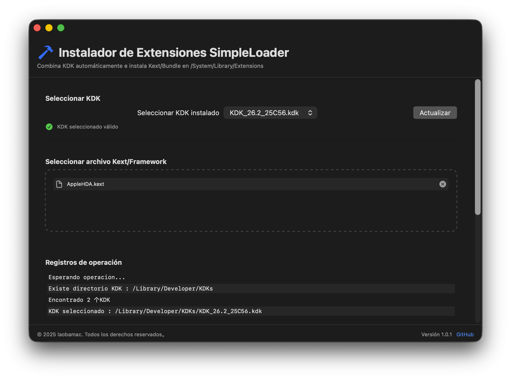

# SimpleLoader - Instalador de extensiones de macOS

Una herramienta gráfica diseñada para macOS que integra de forma segura el KDK (Kernel Debug Kit) e instala extensiones del kernel (Kexts) en el directorio del sistema.

##### [Versión original en chino](README.md) ###

## Características

### Características principales

🔧 **Fusión de KDK**

- Detecta automáticamente los paquetes KDK en el directorio `/Library/Developer/KDKs`
- Proporciona interfaz de selección visual
- Integra de forma segura el KDK en el directorio del sistema

📦 **Instalación de Kext**

- Interfaz de selección de archivos mediante arrastrar y soltar
- Admite la instalación por lotes de múltiples Kexts
- Funciones opcionales de sobrescritura forzada y copia de seguridad

### Herramientas del sistema

⚡ **Administración de caché**

- Reconstrucción de la caché del kernel con un solo clic
- Gestión automática de volúmenes del sistema de sólo lectura en Big Sur y posteriores

📸 **Protección de instantáneas**

- Creación de instantáneas del sistema APFS
- Restauración al último estado de la instantánea
- Red de seguridad para evitar daños al sistema

## Pila tecnológica

- **Lenguaje**: Swift 5.5
- **Marco de interfaz de usuario**: SwiftUI
- **Requisitos mínimos del sistema**: macOS 11 Big Sur
- **Gestión de dependencias**: Gestor de paquetes Swift

## Método de instalación

### Instalación manual

1. Descarga la última versión [Release](https://github.com/laobamac/SimpleLoader/releases)
2. Descomprime y arrástrala a la carpeta Aplicaciones

## Guía del usuario

1. **Seleccionar KDK**

- Selecciona en el menú desplegable la versión de KDK instalada
- Haz clic en el botón "Actualizar" para actualizar la lista

2. **Añadir Kext**

- Arrastra y suelta el archivo `.kext/.bundle` en el área especificada o haz clic en el botón para seleccionar el archivo
- Puedes quitar el archivo seleccionado en cualquier momento

3. **Opciones**

- Forzar sobrescritura: Sobrescribir la Kext con una del mismo nombre
- Copia de seguridad existente: Realizar una copia de seguridad automática de la Kext en el escritorio

4. **Acciones**

- Fusionar Solo KDK: Procesar solo KDK sin instalar Kext
- "Iniciar instalación": Fusionar KDK e instalar todas las Kext seleccionadas

## Funciones avanzadas

### Herramientas de mantenimiento del sistema

- **Reconstruir caché**: Reparar la caché de extensiones del kernel
- **Crear instantánea**: Crear un punto de restauración del sistema
- **Restaurar instantánea**: Revertir al estado de la última instantánea

## Desarrollador

👨‍💻 **laobamac**

- GitHub: [@laobamac](https://github.com/laobamac)
- Correo electrónico: wxcznb@qq.com

## Guía de contribución

¡Bienvenidos a enviar incidencias y *pull requests*!

Asegúrate de que el código cumpla con las especificaciones del proyecto y cómplice y ejecute bien.

## Acuerdo de código abierto

Este proyecto adopta el acuerdo de código abierto de la **Licencia Pública General GNU v3.0**.

Para consultar el acuerdo completo, consulta el archivo [LICENCIA](LICENCIA).
