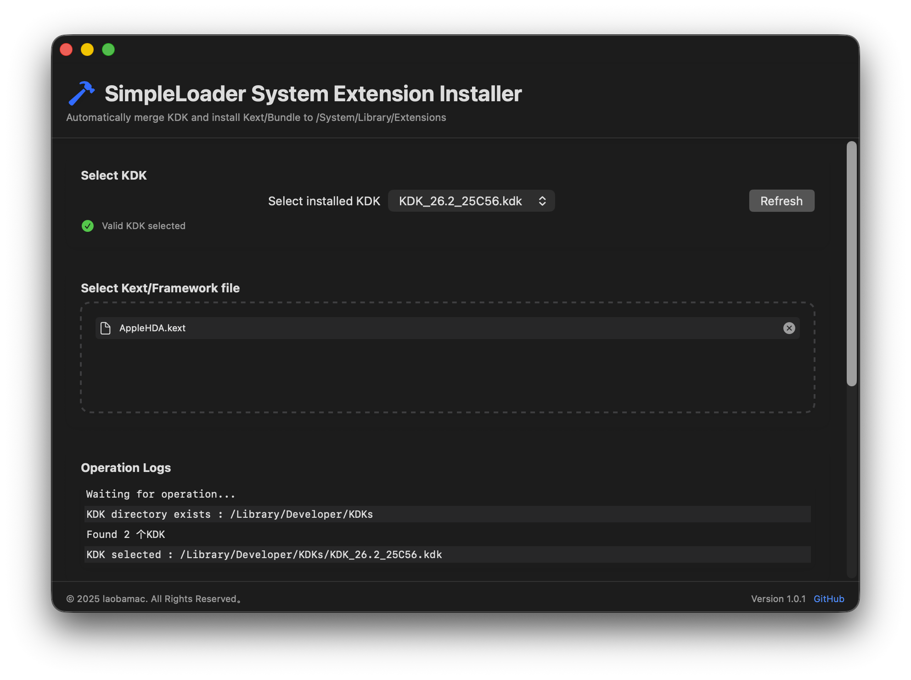

# SimpleLoader - macOS System Extension Installer

A graphical tool designed for macOS to safely merge KDK (Kernel Development Kit) and install kernel extensions (Kext) to the system directory.

##### [中文版 - Chinese version](README-CN.md)

## Features

### Core Features
🔧 **KDK Merge**
- Automatically detect KDK packages in the `/Library/Developer/KDKs` directory
- Provide a visual selection interface
- Safely merge KDK into the system directory

📦 **Kext Installation**
- Drag-and-drop file selection interface
- Support batch installation of multiple Kexts
- Optional forced overwrite and backup functions

### System Tools
⚡ **Cache Management**
- One-click kernel cache rebuild
- Automatically handle read-only system volumes for Big Sur and above

📸 **Snapshot Protection**
- Create APFS system snapshots
- Restore to the last snapshot state
- A safety net to prevent system damage

## Technology Stack

- **Language**: Swift 5.5
- **UI Framework**: SwiftUI
- **Minimum System Requirements**: macOS 11 Big Sur
- **Dependency Management**: Swift Package Manager

## Installation method

### Manual installation
1. Download the latest version [Release](https://github.com/laobamac/SimpleLoader/releases)
2. Unzip and drag to the Applications folder

## User Guide

1. **Select KDK**
- Select the installed KDK version from the drop-down menu
- Click the "Refresh" button to update the list

2. **Add Kext**
- Drag and drop the `.kext/.bundle` file to the specified area, or click the button to select the file
- You can remove the selected file at any time

3. **Set Options**
- Force Overwrite: Overwrite Kext with the same name
- Backup Existing: Automatically back up the replaced Kext to the desktop

4. **Perform Action**
- "Merge KDK Only": Only process KDK without installing Kext
- "Start Installation": Merge KDK and install all selected Kexts

## Advanced Features

### System Maintenance Tools
- **Rebuild Cache**: Repair the kernel extension cache
- **Create Snapshot**: Create a system restore point
- **Restore Snapshot**: Roll back to the last snapshot state

## Developers

👨‍💻 **laobamac**
- GitHub: [@laobamac](https://github.com/laobamac)
- Email: wxcznb@qq.com

## Contribution Guide

Welcome to submit Issues and Pull Requests!

Please make sure the code complies with the project specifications and passes the test.

## Open Source Agreement

This project adopts the **GNU General Public License v3.0** open source agreement.

For the full agreement, see the [LICENSE](LICENSE) file.
